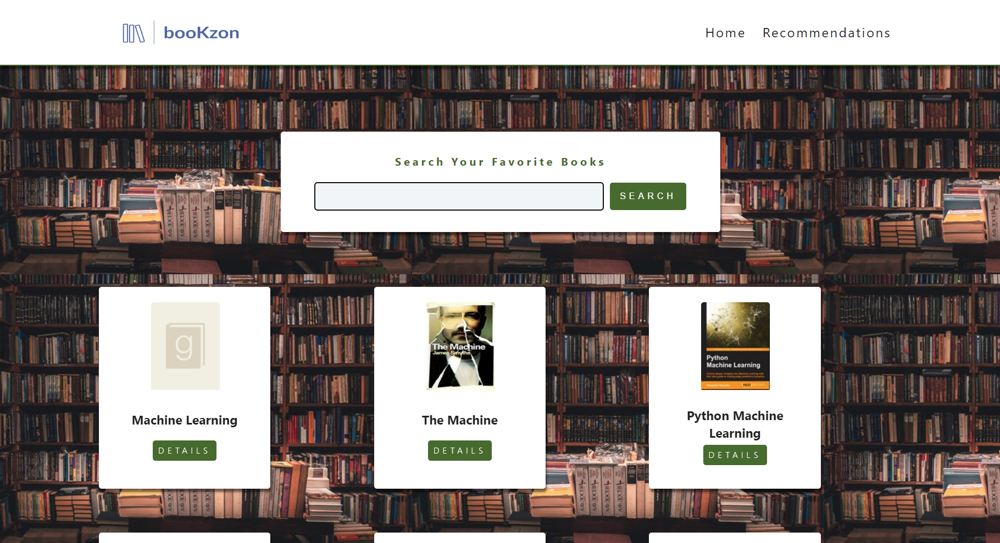
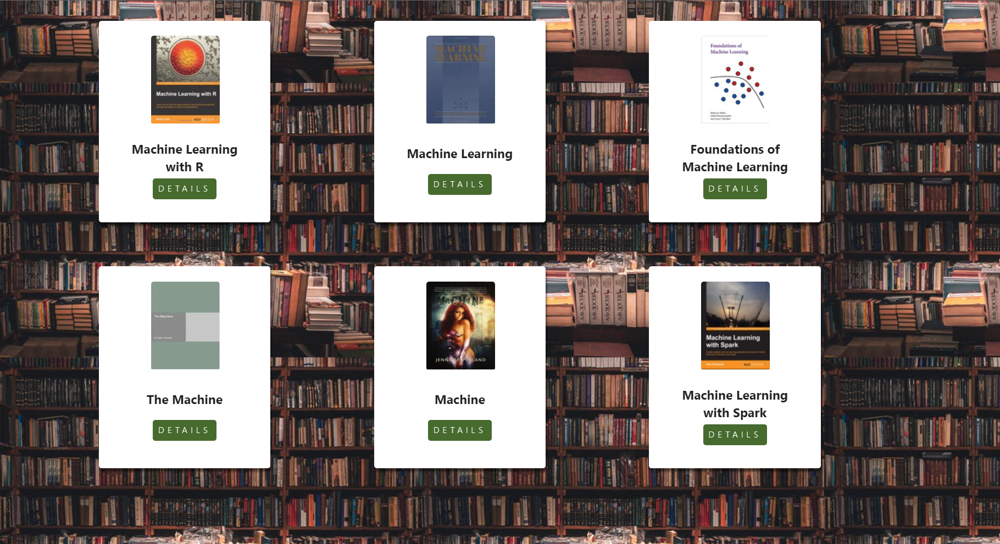
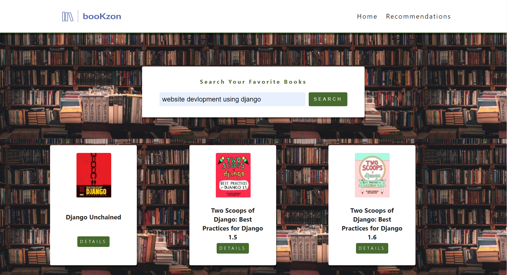
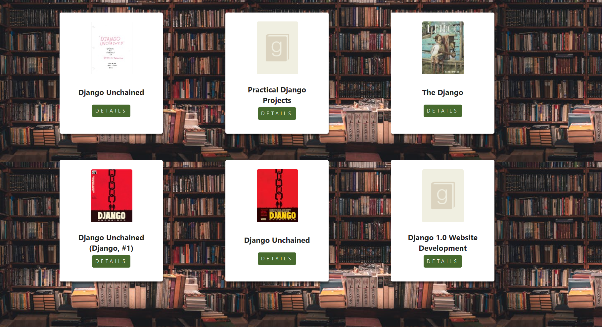
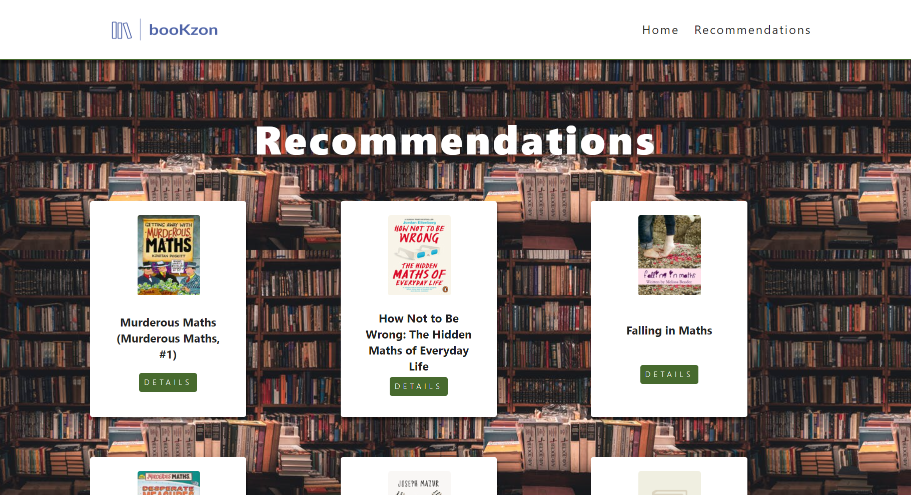
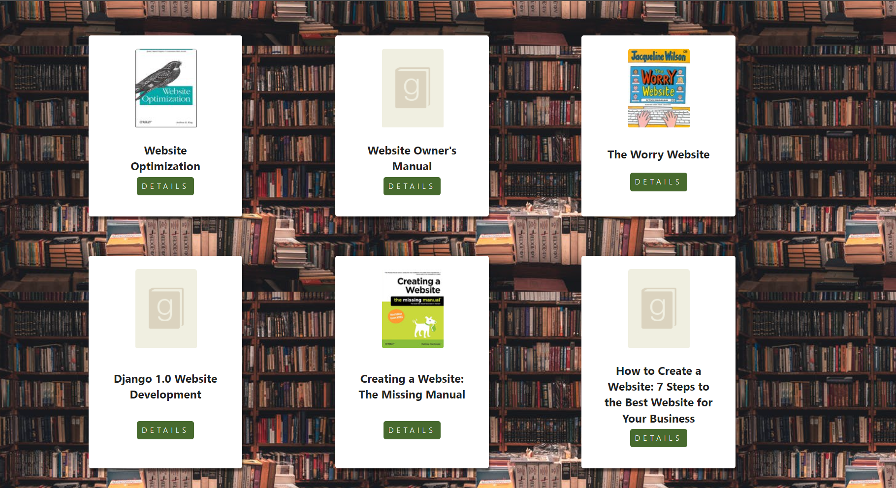
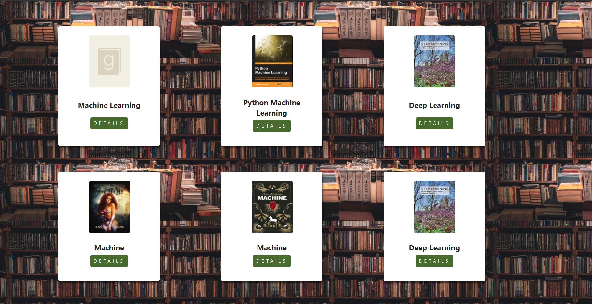

# booKzon
A book recommendation website where you can search your favorite books and based on your search it will recommend you books.It uses cookies to store books you search and based on that it will recommend you books.
## Screenshots
### Search Page

### Recommendation Page

### Tech Stack 
1. Django(Backend)
2. React(Frontend)

### Datasets
To download data files follow below link:
- https://drive.google.com/drive/folders/1NiEmdzRF2R5aHhyYHsVHII5a8VTgBdeG?usp=drive_link

Make a folder of name:'Data' in API folder and put these files into it.

### Setup
Run these commands in terminal to run e project:
- `pip install -r requirements.txt` to install backend dependencies
- `cd frontend` to access frontend folder
- `npm install` to intall frontend dependencies
- `npm run build` to build the app for production to the build folder.
- `cd ..` to access root folder
- `python manage.py makemigrations` to make migrations
- `python manage.py migrate` to migrate
- `python manage.py runserver` to run the local server

Then, navigate to http://127.0.0.1:8000/ in your browser
